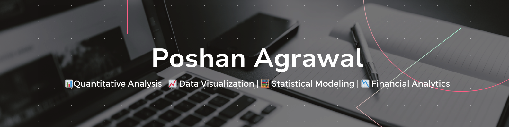

### Hi there. I'm Poshan Agrawal  👋 

<!--
**PoshanAgrawal/PoshanAgrawal** is a ✨ _special_ ✨ repository because its `README.md` (this file) appears on your GitHub profile.

Here are some ideas to get you started:

- 🔭 I’m currently working on ...
- 🌱 I’m currently learning ...
- 👯 I’m looking to collaborate on ...
- 🤔 I’m looking for help with ...
- 💬 Ask me about ...
- 📫 How to reach me: ...
- 😄 Pronouns: ...
- ⚡ Fun fact: ...
-->

[]

## About Me
Greetings! I am Poshan Agrawal, an impassioned learner driven by an insatiable enthusiasm for the realm of quantitative analysis. My journey involves a relentless pursuit of honing my analytical finesse and unraveling myriad quantitative methodologies. This expedition is currently unfolding at the distinguished Indian Institute of Management Bodh Gaya, where I am immersing myself in the multifaceted tapestry of skills that illuminate the world of numbers.

Simultaneously, I am wholeheartedly engaged in pursuing a Master of Science in Financial Engineering from the esteemed WorldQuant University. This parallel voyage is a catalyst for amplifying my expertise within the intricate contours of quantitative finance, forging a seamless bridge between theory and application.
